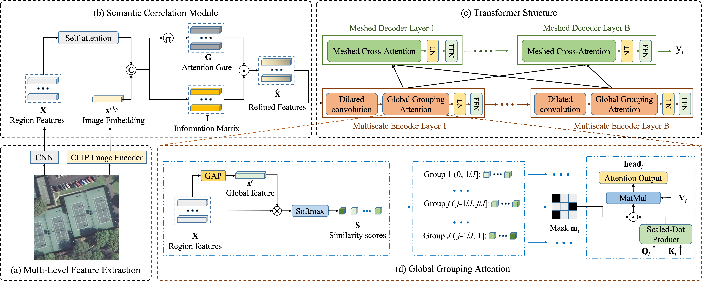

# MG-Transformer
<p align="center">
  
</p>

## Installation and Dependencies
Create the `m2` conda environment using the `environment.yml` file:
```
conda env create -f environment.yml
conda activate m2
```
## Data preparation
For the evaluation metrics, Please download the [evaluation.zip](https://pan.baidu.com/s/13ZfH-CMYbW3RsW0-RX7KKQ)(BaiduPan code:wuiu) and extract it to `./evaluation`.


For Feature Extraction:  
Region feature: `./feature_pro/pre_region_feature.py`  
CLIP image embedding: `./feature_pro/pre_CLIP_feature.py`  
Group mask matrix: `./feature_pro/split_group.py`


## Train
```
python train.py
```

## Evaluate
```
python test.py
```


# Citation:
```
@ARTICLE{10298250,
  author={Meng, Lingwu and Wang, Jing and Meng, Ran and Yang, Yang and Xiao, Liang},
  journal={IEEE Transactions on Geoscience and Remote Sensing}, 
  title={A Multiscale Grouping Transformer with CLIP Latents for Remote Sensing Image Captioning}, 
  year={2024},
  volume={62},
  number={4703515},
  pages={1-15},
  doi={10.1109/TGRS.2024.3385500}}
```


## Reference:
1. https://github.com/tylin/coco-caption
2. https://github.com/aimagelab/meshed-memory-transformer
